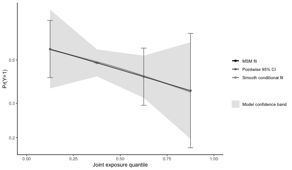
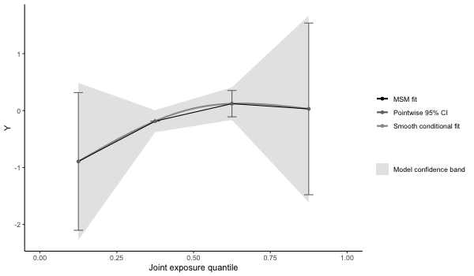

`qgcomp` v2.5.8

#### QGcomp (quantile g-computation): estimating the effects of exposure mixtures. Works for continuous, binary, and right-censored survival outcomes.

#### Flexible, unconstrained, fast and guided by modern causal inference principles
 
  

### Quick start
    # install developers version (requires devtools)
    # install.packages("devtools")
    # devtools::install_github("alexpkeil1/qgcomp")     # master version (usually reliable)
    # devtools::install_github("alexpkeil1/qgcomp@dev") # dev version (may not be working)
    # or install version from CRAN
    install.packages("qgcomp")
    library("qgcomp")
    # using data from the qgcomp package
    data("metals", package="qgcomp")
    
    Xnm <- c(
    'arsenic','barium','cadmium','calcium','chromium','copper',
    'iron','lead','magnesium','manganese','mercury','selenium','silver',
    'sodium','zinc'
    )
    
    # continuous outcome
    results = qc.fit <- qgcomp.noboot(y~.,dat=metals[,c(Xnm, 'y')], family=gaussian())
    print(results)

    
    > Scaled effect size (positive direction, sum of positive coefficients = 0.39)
    >  calcium     iron   barium   silver  arsenic  mercury   sodium chromium 
    >  0.72216  0.06187  0.05947  0.03508  0.03447  0.02451  0.02162  0.02057 
    >  cadmium     zinc 
    >  0.01328  0.00696 
    > 
    > Scaled effect size (negative direction, sum of negative coefficients = -0.124)
    > magnesium    copper      lead manganese  selenium 
    >  0.475999  0.385299  0.074019  0.063828  0.000857 
    > 
    > Mixture slope parameters (Delta method CI):
    > 
    >              Estimate Std. Error Lower CI Upper CI t value
    > (Intercept) -0.356670   0.107878 -0.56811 -0.14523   1e-03
    > psi1         0.266394   0.071025  0.12719  0.40560   2e-04
    p = plot(results, suppressprint=TRUE)
    ggplot2::ggsave("res1.png", plot=p, dpi=72, width=600/72, height=350/72, units="in")

    
    # binary outcome
    results2 = qgcomp.noboot(disease_state~., expnms=Xnm, 
               data = metals[,c(Xnm, 'disease_state')], family=binomial(), q=4)
    print(results2)
    
    > Scaled effect size (positive direction, sum of positive coefficients = 0.392)
    >    barium      zinc  chromium magnesium    silver    sodium 
    >    0.3520    0.2002    0.1603    0.1292    0.0937    0.0645 
    > 
    > Scaled effect size (negative direction, sum of negative coefficients = -0.696)
    >  selenium    copper   arsenic   calcium manganese   cadmium   mercury      lead 
    >    0.2969    0.1627    0.1272    0.1233    0.1033    0.0643    0.0485    0.0430 
    >      iron 
    >    0.0309 
    > 
    > Mixture log(OR) (Delta method CI):
    > 
    >             Estimate Std. Error Lower CI Upper CI Z value Pr(>|z|)
    > (Intercept)  0.26362    0.51615 -0.74802  1.27526  0.5107   0.6095
    > psi1        -0.30416    0.34018 -0.97090  0.36258 -0.8941   0.3713
        
    p2 = plot(results2, suppressprint=TRUE)
    ggplot2::ggsave("res2.png", plot=p2, dpi=72, width=600/72, height=350/72, units="in")

    
### adjusting for covariate(s)
    
    results3 = qgcomp.noboot(y ~ mage35 + arsenic + barium + cadmium + calcium + chloride + 
                           chromium + copper + iron + lead + magnesium + manganese + 
                           mercury + selenium + silver + sodium + zinc,
                         expnms=Xnm,
                         metals, family=gaussian(), q=4)
    print(results3)
    
    > Scaled effect size (positive direction, sum of positive coefficients = 0.381)
    >  calcium   barium     iron   silver  arsenic  mercury chromium     zinc 
    >  0.74466  0.06636  0.04839  0.03765  0.02823  0.02705  0.02344  0.01103 
    >   sodium  cadmium 
    >  0.00775  0.00543 
    > 
    > Scaled effect size (negative direction, sum of negative coefficients = -0.124)
    > magnesium    copper      lead manganese  selenium 
    >   0.49578   0.35446   0.08511   0.06094   0.00372 
    > 
    > Mixture slope parameters (Delta method CI):
    > 
    >              Estimate Std. Error Lower CI Upper CI t value
    > (Intercept) -0.348084   0.108037 -0.55983 -0.13634  0.0014
    > psi1         0.256969   0.071459  0.11691  0.39703  0.0004

    # coefficient for confounder
    results3$fit$coefficients['mage35']
    >      mage35 
    >  0.03463519 

### Bootstrapping to get population average risk ratio via g-computation using qgcomp.boot
    results4 = qgcomp.boot(disease_state~., expnms=Xnm, 
          data = metals[,c(Xnm, 'disease_state')], family=binomial(), 
          q=4, B=1000,# B should be 200-500+ in practice
          seed=125, rr=TRUE)
    print(results4)
    
    > Mixture log(RR) (bootstrap CI):
    >
    >    Estimate Std. Error Lower CI  Upper CI Z value Pr(>|z|)
    > (Intercept) -0.56237    0.23724 -1.02736 -0.097379 -2.3704  0.01777
    > psi1        -0.16373    0.17196 -0.50076  0.173312 -0.9521  0.34104
    > 

    # checking whether model fit seems appropriate (note that this appears slightly non-linear
    # because the model is on the log-odds scale, but the plot is on the additive scale
    p4 = plot(results4, suppressprint=TRUE)
    ggplot2::ggsave("res4.png", plot=p4, dpi=72, width=600/72, height=350/72, units="in")

### Allowing for interactions and non-linear terms using qgcomp.boot

    results5 = qgcomp(y~. + .^2 + arsenic*cadmium,
                         expnms=Xnm,
                         metals[,c(Xnm, 'y')], family=gaussian(), q=4, B=10, 
                         seed=125, degree=2)

    print(results5)
    
    > Mixture slope parameters (bootstrap CI):
    > 
    >             Estimate Std. Error Lower CI Upper CI t value
    > (Intercept) -0.89239    0.73836 -2.33955  0.55477  0.2277
    > psi1         0.90649    0.99245 -1.03869  2.85166  0.3617
    > psi2        -0.19970    0.33848 -0.86311  0.46372  0.5556

    # some apparent non-linearity, but would require more bootstrap iterations for
    # proper test of non-linear mixture effect
    p5 = plot(results5, suppressprint=TRUE)
    ggplot2::ggsave("res5.png", plot=p5, dpi=72, width=600/72, height=350/72, units="in")

### Survival outcomes with and without bootstrapping (fitting a marginal structural cox model to estimate the hazard ratio)

    results6 = qgcomp.cox.noboot(Surv(disease_time, disease_state)~.,
                         expnms=Xnm,
                         metals[,c(Xnm, 'disease_time', 'disease_state')])

    print(results6)
    
    > Scaled effect size (positive direction, sum of positive coefficients = 0.32)
    >    barium      zinc magnesium  chromium    silver    sodium      iron 
    >    0.3432    0.1946    0.1917    0.1119    0.0924    0.0511    0.0151 
    > 
    > Scaled effect size (negative direction, sum of negative coefficients = -0.554)
    >  selenium    copper   calcium   arsenic manganese   cadmium      lead 
    >    0.2705    0.1826    0.1666    0.1085    0.0974    0.0794    0.0483 
    >   mercury 
    >    0.0466 
    > 
    > Mixture log(hazard ratio) (Delta method CI):
    > 
    >      Estimate Std. Error Lower CI Upper CI Pr(>|t|)
    > psi1 -0.23356    0.24535 -0.71444  0.24732   0.3411
    
    results7 = qgcomp.cox.boot(Surv(disease_time, disease_state)~.,
                         expnms=Xnm,
                         metals[,c(Xnm, 'disease_time', 'disease_state')], 
                         B=10, MCsize=5000)

    p7 = plot(results7, suppressprint=TRUE)
    ggplot2::ggsave("res7.png", plot=p4, dpi=72, width=600/72, height=350/72, units="in")

### More help

See the vignette which is included with the `qgcomp` R package, and is accessible in 
R via `vignette("qgcomp-vignette", package="qgcomp")`
