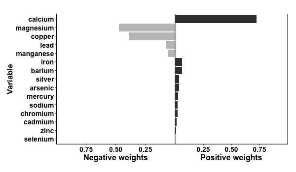

#### QGcomp (quantile g-computation): an alternative to weighted quantile sums for estimating the effects of an exposure mixture that does not assume effects of all exposures go in the same direction. Works for continuous and binary outcomes.

### Quick start

    #install.packages("devtools") # if devtools package not already installed, uncomment this line
    # install developers version
    devtools::install_github("alexpkeil1/qgcomp", build_opts = c("--no-resave-data", "--no-manual", "--build-vignettes"))
    library("qgcomp")
    # using data from the qgcomp package
    data("metals", package="qgcomp")
    
    Xnm <- c(
    'arsenic','barium','cadmium','calcium','chloride','chromium','copper',
    'iron','lead','magnesium','manganese','mercury','selenium','silver',
    'sodium','zinc'
    )
    
    # continuous outcome
    results = qc.fit <- qgcomp.noboot(y~.,dat=metals[,c(Xnm, 'y')], family=gaussian())
    print(results)

    
    >Scaled effect size (positive direction, sum of positive coefficients = 0.118)
    >  calcium manganese   mercury  chloride      zinc    sodium  selenium 
    >   0.5974    0.0791    0.0761    0.0739    0.0704    0.0658    0.0373 
    >
    >Scaled effect size (negative direction, sum of negative coefficients = -0.0732)
    >magnesium   cadmium    silver      lead   arsenic    copper  chromium    barium      iron 
    >   0.2673    0.1758    0.1303    0.1047    0.0872    0.0831    0.0796    0.0584    0.0136 
    >
    >Mixture slope parameters (Delta method CI):
    >
    >     Estimate Std. Error  Lower CI Upper CI t value Pr(>|t|)
    >psi1 0.044589   0.019180 0.0069964 0.082182  2.3247  0.02055    
    plot(results)

    
    # binary outcome
    results2 = qgcomp.noboot(disease_state~., expnms=Xnm, 
               data = metals[,c(Xnm, 'disease_state')], family=binomial(), q=4)
    print(results2)
    
    >Scaled effect size (positive direction, sum of positive coefficients = 1.83)
    > mercury  arsenic  cadmium selenium   silver   copper chloride   sodium chromium   barium 
    > 0.41512  0.22194  0.11081  0.11037  0.03762  0.03140  0.02883  0.02714  0.01515  0.00161 
    >
    >Scaled effect size (negative direction, sum of negative coefficients = -0.851)
    >manganese      lead      zinc      iron magnesium   calcium 
    >   0.5635    0.2145    0.1342    0.0358    0.0307    0.0213 
    >
    >Mixture log(OR) (Delta method CI):
    >
    >     Estimate Std. Error Lower CI Upper CI Z value Pr(>|z|)
    >psi1  0.97669    0.37724   0.2373   1.7161   2.589 0.009625
    >
        
    plot(results2)

    
### adjusting for covariate(s)
    results3 = qgcomp.noboot(y ~ mage35 + arsenic + barium + cadmium + calcium + chloride + 
                           chromium + copper + iron + lead + magnesium + manganese + 
                           mercury + selenium + silver + sodium + zinc,
                         expnms=Xnm,
                         metals, family=gaussian(), q=4)
    print(results3)
    
    > Scaled effect size (positive direction, sum of positive coefficients = 0.117)
    >   calcium manganese   mercury  chloride      zinc    sodium  selenium 
    >    0.5989    0.0800    0.0749    0.0736    0.0681    0.0599    0.0445 
    > 
    > Scaled effect size (negative direction, sum of negative coefficients = -0.0689)
    > magnesium   cadmium    silver      lead  chromium    copper    barium   arsenic      iron 
    >    0.2793    0.1454    0.1378    0.0967    0.0930    0.0865    0.0727    0.0647    0.0239 
    > 
    > Mixture slope parameters (Delta method CI):
    > 
    >      Estimate Std. Error Lower CI Upper CI t value Pr(>|t|)
    > psi1 0.048393   0.019269 0.010627 0.086159  2.5115  0.01238
    # coefficient for confounder
    results3$fit$coefficients['mage35']
    >      mage35 
    > -0.02099359 

### Bootstrapping to get population average risk ratio via g-computation using qgcomp.boot
    results4 = qgcomp.boot(disease_state~., expnms=Xnm, 
          data = metals[,c(Xnm, 'disease_state')], family=binomial(), 
          q=4, B=10,# B should be 200-500+ in practice
          seed=125, rr=TRUE)
    print(results4)
    
    > Mixture log(RR) (bootstrap CI):
    > 
    >      Estimate Std. Error Lower CI Upper CI Z value  Pr(>|z|)
    > psi1  0.31318    0.07747  0.16134  0.46502  4.0426 5.286e-05

    # checking whether model fit seems appropriate 
    plot(results4)

    # Note that the smooth fit differs from the model fit. This is 
    # a direct result of the difference between modeling risks
    # and modeling odds when the outcome of interest is not rare
    # The smoothed fit is based on predictions from the underlying 
    # logistic model whereas "model fit" is based on predictions
    # from the marginal model for changes in the exposure mixture.
    # This result suggests that including interaction terms between
    # elements of the mixture and/or including a second order psi term
    # (via `degree=2`) may be useful.

### Allowing for interactions and non-linear terms using qgcomp.boot

    results5 = qgcomp(y~. + .^2 + arsenic*cadmium,
                         expnms=Xnm,
                         metals[,c(Xnm, 'y')], family=gaussian(), q=4, B=10, 
                         seed=125, degree=2)

    print(results5)
    
    > Mixture slope parameters (bootstrap CI):
    > 
    >         Estimate  Std. Error Lower CI Upper CI t value Pr(>|t|)
    > psi1 -0.00090979  0.27733904 -0.54448  0.54266 -0.0033   0.9974
    > psi2  0.01124374  0.09166007 -0.16841  0.19089  0.1227   0.9024

    # some apparent non-linearity, but would require more bootstrap iterations for
    # proper test of non-linear mixture effect
    plot(results5)

