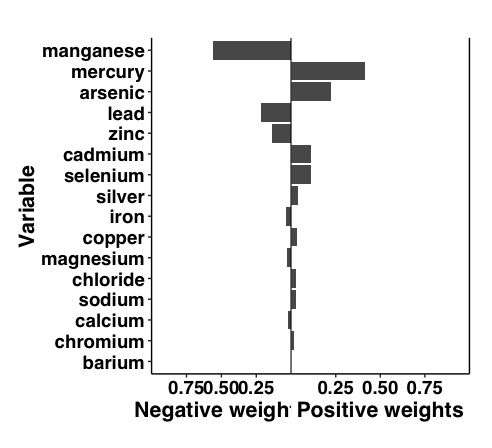

QGcomp: an alternative to weighted least squares that does not assume effects of all exposures go in the same direction. Works for linear and logistic models.

Quick start

    install.packages("devtools")
    devtools::install_github("alexpkeil1/qgcomp")
    library("qgcomp")
    data("wqs_data", package="gWQS")
    
    Xnm = c(
    "log_LBX074LA", "log_LBX099LA", "log_LBX105LA", "log_LBX118LA",
    "log_LBX138LA", "log_LBX153LA", "log_LBX156LA", "log_LBX157LA", "log_LBX167LA",
    "log_LBX170LA", "log_LBX180LA", "log_LBX187LA", "log_LBX189LA", "log_LBX194LA",
    "log_LBX196LA", "log_LBX199LA", "log_LBXD01LA", "log_LBXD02LA", "log_LBXD03LA",
    "log_LBXD04LA", "log_LBXD05LA", "log_LBXD07LA", "log_LBXF01LA", "log_LBXF02LA",
    "log_LBXF03LA", "log_LBXF04LA", "log_LBXF05LA", "log_LBXF06LA", "log_LBXF07LA",
    "log_LBXF08LA", "log_LBXF09LA", "log_LBXPCBLA", "log_LBXTCDLA", "log_LBXHXCLA"
    )
    
    # continuous outcome
    results = qgcomp.noboot(y~.,dat=wqs_data[,c(Xnm, 'y')], family=gaussian())
    print(results)

    
    > Scaled effect size (positive direction, sum of positive coefficients = 1.91)
    > log_LBXD02LA log_LBX138LA log_LBXF06LA log_LBXF07LA log_LBX105LA log_LBX157LA log_LBXD04LA log_LBX167LA log_LBX196LA log_LBXHXCLA log_LBXF08LA log_LBXF04LA log_LBX118LA log_LBXD05LA log_LBXD01LA log_LBX153LA log_LBX074LA log_LBXF01LA 
    >      0.16027      0.14747      0.12395      0.11291      0.09349      0.07107      0.05722      0.04455      0.03811      0.03638      0.03508      0.01873      0.01740      0.01237      0.01025      0.00728      0.00719      0.00628 
    > 
    > Scaled effect size (negative direction, sum of negative coefficients = -0.419)
    > log_LBX170LA log_LBXF03LA log_LBX180LA log_LBX199LA log_LBXTCDLA log_LBX099LA log_LBXD07LA log_LBXF09LA log_LBX187LA log_LBXPCBLA log_LBXF05LA log_LBX194LA log_LBX189LA log_LBX156LA log_LBXD03LA log_LBXF02LA 
    >      0.21514      0.14089      0.09700      0.08781      0.08724      0.06829      0.06297      0.05360      0.04339      0.04015      0.03784      0.03382      0.01920      0.00525      0.00495      0.00247 
    > 
    > Mixture slope:
    > gamma (CI): 1.49 (1.29,1.69), t=14.4, df=465, p=0
    
    plot(results)

    
    # binary outcome
    results2 = qgcomp.noboot(disease_state~.,dat=wqs_data[,c(Xnm, 'disease_state')], family=binomial())
    print(results2)
    
    > Scaled effect size (positive direction, sum of positive coefficients = 1.69)
    > log_LBX156LA log_LBX194LA log_LBX105LA log_LBX138LA log_LBXF09LA log_LBXHXCLA log_LBXD02LA log_LBXF08LA log_LBXD04LA log_LBXD01LA log_LBXF05LA log_LBXPCBLA log_LBX118LA log_LBX153LA log_LBX189LA log_LBXF01LA log_LBX157LA log_LBX180LA log_LBXF03LA log_LBXD05LA log_LBX187LA 
    >     0.098960     0.094117     0.090794     0.073728     0.071542     0.071025     0.067497     0.066298     0.055614     0.052980     0.051612     0.039568     0.037921     0.028775     0.026268     0.024350     0.024323     0.013647     0.008858     0.001437     0.000685 
    > 
    > Scaled effect size (negative direction, sum of negative coefficients = -1.74)
    > log_LBX170LA log_LBXD07LA log_LBX199LA log_LBXF07LA log_LBX167LA log_LBXF04LA log_LBXF06LA log_LBX099LA log_LBX196LA log_LBXF02LA log_LBXD03LA log_LBX074LA log_LBXTCDLA 
    >       0.1666       0.1455       0.1442       0.1280       0.1041       0.1021       0.0426       0.0406       0.0302       0.0264       0.0247       0.0241       0.0210 
    > 
    > Mixture log(OR):
    > gamma (CI): -0.0581 (-0.472,0.356), t=-0.275, df=465, p=0.784
    
    plot(results2)

    
    # adjusting for covariate(s)
    results3 = qgcomp.noboot(y~ sex + 
                              log_LBX074LA + log_LBX099LA + log_LBX105LA + log_LBX118LA + log_LBX138LA + 
                              log_LBX153LA + log_LBX156LA + log_LBX157LA + log_LBX167LA + log_LBX170LA + 
                              log_LBX180LA + log_LBX187LA + log_LBX189LA + log_LBX194LA + log_LBX196LA + 
                              log_LBX199LA + log_LBXD01LA + log_LBXD02LA + log_LBXD03LA + log_LBXD04LA + 
                              log_LBXD05LA + log_LBXD07LA + log_LBXF01LA + log_LBXF02LA + log_LBXF03LA + 
                              log_LBXF04LA + log_LBXF05LA + log_LBXF06LA + log_LBXF07LA + log_LBXF08LA + 
                              log_LBXF09LA + log_LBXPCBLA + log_LBXTCDLA + log_LBXHXCLA,
                            dat=wqs_data[,c(Xnm, 'y', 'sex')], 
                            expcoefs = c(FALSE, rep(TRUE, length(Xnm))), family=gaussian())
    print(results3)
    
    > Scaled effect size (positive direction, sum of positive coefficients = 1.91)
    > log_LBXD02LA log_LBX138LA log_LBXF06LA log_LBXF07LA log_LBX105LA log_LBX157LA log_LBXD04LA log_LBX167LA log_LBX196LA log_LBXHXCLA log_LBXF08LA log_LBXF04LA log_LBX118LA log_LBXD05LA log_LBXD01LA log_LBX153LA log_LBX074LA log_LBXF01LA 
    >      0.16030      0.14719      0.12454      0.11194      0.09385      0.07170      0.05672      0.04484      0.03771      0.03678      0.03608      0.01832      0.01822      0.01200      0.00895      0.00805      0.00669      0.00613 
    > 
    > Scaled effect size (negative direction, sum of negative coefficients = -0.42)
    > log_LBX170LA log_LBXF03LA log_LBX180LA log_LBXTCDLA log_LBX199LA log_LBX099LA log_LBXD07LA log_LBXF09LA log_LBX187LA log_LBXF05LA log_LBXPCBLA log_LBX194LA log_LBX189LA log_LBXF02LA log_LBXD03LA log_LBX156LA 
    >      0.21761      0.14170      0.09801      0.08916      0.08640      0.06524      0.05973      0.05362      0.04400      0.03737      0.03666      0.03182      0.02266      0.00669      0.00505      0.00429 
    > 
    > Mixture slope:
    > gamma (CI): 1.49 (1.29,1.69), t=14.4, df=465, p=0
    
    # coefficient for confounder
    results3$fit$coefficients['sex']
    
    >         sex 
    > -0.04602814 

