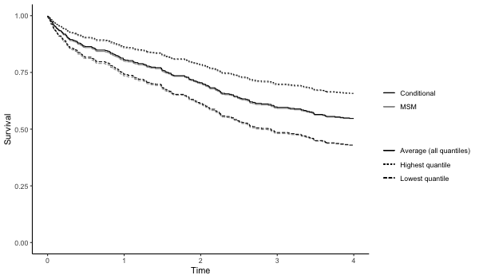

#### QGcomp (quantile g-computation): estimating the effects of exposure mixtures. Works for continuous, binary, and right-censored survival outcomes.

#### Flexible, unconstrained, fast and guided by modern causal inference principles

### Quick start

Using the data from the `qgcomp` package to estimate the effect of a simultaneous increase
in a set of metals found in wellwater on a continuous health outcome.

    # install developers version (requires devtools)
    # install.packages("devtools")
    # devtools::install_github("alexpkeil1/qgcomp")     # master version (usually reliable)
    # devtools::install_github("alexpkeil1/qgcomp@dev") # dev version (may not be working)
    # or install version from CRAN
    install.packages("qgcomp")
    library("qgcomp")
    # using data from the qgcomp package
    data("metals", package="qgcomp")
    
    Xnm <- c(
    'arsenic','barium','cadmium','calcium','chromium','copper',
    'iron','lead','magnesium','manganese','mercury','selenium','silver',
    'sodium','zinc'
    )
    
    # continuous outcome
    results = qc.fit <- qgcomp.noboot(y~.,dat=metals[,c(Xnm, 'y')], family=gaussian())
    print(results)

    
    >Scaled effect size (positive direction, sum of positive coefficients = 0.425)
    >  calcium    barium   mercury manganese   arsenic  chromium      iron   cadmium      lead    copper 
    > 0.727104  0.076455  0.067479  0.046667  0.030523  0.018701  0.016592  0.013656  0.002462  0.000362 
    >
    >Scaled effect size (negative direction, sum of negative coefficients = -0.167)
    >magnesium      zinc    silver    sodium  selenium 
    >   0.3906    0.2473    0.1801    0.1489    0.0331 
    >
    >Mixture slope parameters (Delta method CI):
    >
    >     Estimate Std. Error Lower CI Upper CI t value  Pr(>|t|)
    >psi1 0.257774   0.073702  0.11332  0.40223  3.4975 0.0005178
    plot(results)

    
    # binary outcome
    results2 = qgcomp.noboot(disease_state~., expnms=Xnm, 
               data = metals[,c(Xnm, 'disease_state')], family=binomial(), q=4)
    print(results2)
    
    >Scaled effect size (positive direction, sum of positive coefficients = 1.69)
    > mercury  arsenic  calcium     zinc   silver   copper  cadmium selenium 
    >  0.3049   0.1845   0.1551   0.1153   0.0828   0.0730   0.0645   0.0199 
    >
    >Scaled effect size (negative direction, sum of negative coefficients = -0.733)
    >   barium      lead  chromium      iron manganese magnesium    sodium 
    >   0.2679    0.2571    0.2304    0.1267    0.0542    0.0481    0.0156 
    >
    >Mixture log(OR) (Delta method CI):
    >
    >     Estimate Std. Error Lower CI Upper CI Z value Pr(>|z|)
    >psi1  0.95579    0.46656 0.041347   1.8702  2.0486   0.0405
        
    plot(results2)

    
### adjusting for covariate(s)
    
    results3 = qgcomp.noboot(y ~ mage35 + arsenic + barium + cadmium + calcium + chloride + 
                           chromium + copper + iron + lead + magnesium + manganese + 
                           mercury + selenium + silver + sodium + zinc,
                         expnms=Xnm,
                         metals, family=gaussian(), q=4)
    print(results3)
    
    >Scaled effect size (positive direction, sum of positive coefficients = 0.434)
    >  calcium    barium   mercury manganese   arsenic  chromium   cadmium      iron      lead 
    >  0.71389   0.08325   0.06767   0.05064   0.03706   0.02049   0.01150   0.01052   0.00497 
    >
    >Scaled effect size (negative direction, sum of negative coefficients = -0.178)
    >magnesium      zinc    silver    sodium  selenium    copper 
    >   0.3726    0.2325    0.1820    0.1636    0.0312    0.0182 
    >
    >Mixture slope parameters (Delta method CI):
    >
    >     Estimate Std. Error Lower CI Upper CI t value Pr(>|t|)
    >psi1 0.256057   0.073911   0.1112  0.40092  3.4644 0.000584

    # coefficient for confounder
    results3$fit$coefficients['mage35']
    >      mage35 
    > -0.03533382 

### Bootstrapping to get population average risk ratio via g-computation using qgcomp.boot
    results4 = qgcomp.boot(disease_state~., expnms=Xnm, 
          data = metals[,c(Xnm, 'disease_state')], family=binomial(), 
          q=4, B=10,# B should be 200-500+ in practice
          seed=125, rr=TRUE)
    print(results4)
    
    >Mixture log(RR) (bootstrap CI):
    >
    >     Estimate Std. Error Lower CI Upper CI Z value Pr(>|z|)
    >psi1  0.77156    0.32901  0.12673   1.4164  2.3451  0.01902

    # checking whether model fit seems appropriate (note that this appears slightly non-linear
    # because the model is on the log-odds scale, but the plot is on the additive scale
    plot(results4)

### Allowing for interactions and non-linear terms using qgcomp.boot

    results5 = qgcomp(y~. + .^2 + arsenic*cadmium,
                         expnms=Xnm,
                         metals[,c(Xnm, 'y')], family=gaussian(), q=4, B=10, 
                         seed=125, degree=2)

    print(results5)
    
    >Mixture slope parameters (bootstrap CI):
    >
    >      Estimate Std. Error Lower CI Upper CI t value Pr(>|t|)
    >psi1  0.506959   0.551494 -0.57395  1.58787  0.9192   0.3586
    >psi2 -0.070952   0.156897 -0.37846  0.23656 -0.4522   0.6514

    # some apparent non-linearity, but would require more bootstrap iterations for
    # proper test of non-linear mixture effect
    plot(results5)

### Survival outcomes with and without bootstrapping (fitting a marginal structural cox model to estimate the hazard ratio)

    results6 = qgcomp.cox.noboot(Surv(disease_time, disease_state)~.,
                         expnms=Xnm,
                         metals[,c(Xnm, 'disease_time', 'disease_state')])

    print(results6)
    
    > Scaled effect size (positive direction, sum of positive coefficients = 0.32)
    >    barium      zinc magnesium  chromium    silver    sodium      iron 
    >    0.3432    0.1946    0.1917    0.1119    0.0924    0.0511    0.0151 
    > 
    > Scaled effect size (negative direction, sum of negative coefficients = -0.554)
    >  selenium    copper   calcium   arsenic manganese   cadmium      lead 
    >    0.2705    0.1826    0.1666    0.1085    0.0974    0.0794    0.0483 
    >   mercury 
    >    0.0466 
    > 
    > Mixture log(hazard ratio) (Delta method CI):
    > 
    >      Estimate Std. Error Lower CI Upper CI Pr(>|t|)
    > psi1 -0.23356    0.24535 -0.71444  0.24732   0.3411
    
    results7 = qgcomp.cox.boot(Surv(disease_time, disease_state)~.,
                         expnms=Xnm,
                         metals[,c(Xnm, 'disease_time', 'disease_state')], 
                         B=10, MCsize=5000)

    plot(results7)

### More help

See the vignette which is included with the `qgcomp` R package, and is accessible in 
R via `vignette("qgcomp-vignette", package="qgcomp")`
