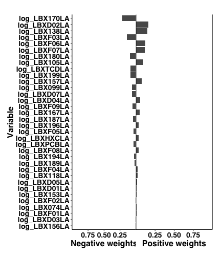
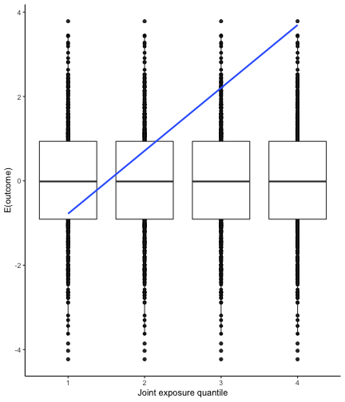
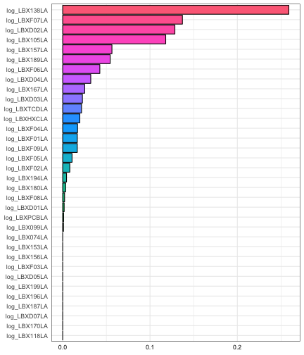
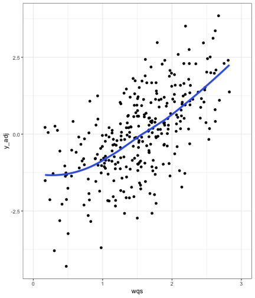

## Introduction

## How to use the `qgcomp` package

### Example 1

Here are some observations from  `wqs_data` dataset from the from the package `gQWS`. 
These data will be used as an ongoing example to demonstrate features of the
`qgcomp` package. Parallel examples can be seen in the `gQWS` help files.


```
##             y disease_state sex log_LBX074LA log_LBX099LA log_LBX105LA
## 1  -0.4224332             1   0   0.06807159   -0.1608614    0.9648013
## 2   0.7613784             0   0   0.52766764    1.4403102    0.7753093
## 3  -2.1113324             1   1  -1.86501393    1.4885628   -1.5420050
## 4   2.2222394             0   0   1.25852086    1.6110700    2.2069536
## 5  -0.2190805             1   0  -1.01387125   -1.9903436   -0.6009229
## 6  -1.7282770             0   0  -0.97525732   -0.6864727    0.3389021
## 7   0.4219639             0   1  -0.62259834    1.0113598   -0.2162429
## 8  -0.4762419             0   1  -0.18010508   -0.5805092   -0.8038376
## 9  -0.5126990             1   0   0.45021865    0.7892304    0.7107290
## 10 -0.8479847             1   0  -0.44612214   -1.0556249    1.0676569
##    log_LBX118LA log_LBX138LA log_LBX153LA log_LBX156LA log_LBX157LA
## 1   -0.18156840   0.75067969    0.9363278 -0.036408822   0.19714994
## 2    0.10557644  -0.90151006    0.1677693  0.764358720  -0.60014771
## 3   -0.54122704  -1.36244923   -0.4177779  0.141400096   0.13335899
## 4    1.32861829   1.88712009    1.8393058  2.275153547   1.13077667
## 5   -0.89074667  -0.47894428   -2.8190387 -0.009540165  -1.54771374
## 6    0.59842461   0.02703001   -0.4798327 -0.386712303  -1.03776810
## 7    0.75750082  -0.25717289    0.9804511  0.445804252   1.39626806
## 8   -0.77860344  -1.54575389   -1.3117169 -0.973430032  -0.02618996
## 9    0.27545487   0.06138062    0.3399312  1.017651770   1.18071737
## 10   0.06815638  -0.95821671   -0.3967903  0.019609951   0.04671192
##    log_LBX167LA log_LBX170LA log_LBX180LA log_LBX187LA log_LBX189LA
## 1     1.1192873    0.2972489   0.19203838  -0.52570440   -0.1659253
## 2     0.6175614   -0.3577213   0.28795457  -0.15570952   -0.6755189
## 3    -0.9901708    0.1024100  -0.06229319   1.08242923   -0.6920183
## 4     1.2204913    0.1958512   0.94614972  -0.03259417   -0.3940764
## 5     0.5180853   -2.1491031  -2.79518628  -1.57557788   -0.5270997
## 6    -0.7329465   -0.7148301   0.40604713  -0.50768809    0.2215813
## 7    -0.1979610    0.1995122   1.46690894   1.06344138    0.8339600
## 8     0.5308421   -0.2485865   0.21031180  -0.09123444   -0.1011264
## 9     1.2440091    1.5589123  -0.84052779  -0.20022330    0.2201809
## 10    0.5172333    0.2781621   0.16748214   1.18793190   -1.0221745
##    log_LBX194LA log_LBX196LA log_LBX199LA log_LBXD01LA log_LBXD02LA
## 1    0.40174898  -0.01431334    0.8692975   0.08463091  0.001251086
## 2    0.05191144   0.33513341   -1.1385368   0.58520996 -1.453999806
## 3   -1.72047596  -1.20792248    0.3543356  -0.81161855 -0.879024951
## 4    0.29847531   0.78373465    1.9352485   0.19735763  0.837658576
## 5   -0.24509043  -1.12429928   -0.6902691  -0.57910611 -1.949550422
## 6    0.32121462  -0.18099936    1.4622912   0.01652519 -0.602605801
## 7    1.58671413   0.72494899    0.7584681   0.27013632  0.931719299
## 8   -0.42170510   0.46821312   -0.9008740  -0.43902363 -1.038499383
## 9    0.22844410  -0.17422712   -0.1887278   0.30275532 -0.379749079
## 10  -1.38799761  -0.72951265   -1.7526492  -0.76682068  0.592379784
##    log_LBXD03LA log_LBXD04LA log_LBXD05LA log_LBXD07LA log_LBXF01LA
## 1   -0.28477842   0.63274537   0.40784216    0.1661874  -1.29055805
## 2    1.11166910   0.07676037  -0.02952922   -1.2578515  -0.02466414
## 3    0.46164291  -2.01014110  -1.28595847    0.8281122   0.09212120
## 4   -1.27150808  -1.25771455  -0.57866189    0.6304414   1.31482790
## 5   -1.34260060   0.61780378  -1.25876664   -0.3310535  -1.58826325
## 6   -0.08650806  -0.75741907  -0.09182362   -0.3804055  -0.01506274
## 7    0.09632731   0.39449928   0.68278998   -0.5437556   0.95048196
## 8   -1.05100641  -0.16171073  -1.50147657   -1.1384429   1.76966547
## 9   -0.40892638  -0.54280111   1.29649703   -0.2374201   0.12066233
## 10   1.04638186   0.98569472  -1.16737927   -0.7855519  -0.86384273
##    log_LBXF02LA log_LBXF03LA log_LBXF04LA log_LBXF05LA log_LBXF06LA
## 1    -1.0359049   1.68939665  -0.19426548    0.4322813   -1.8049708
## 2     0.5600564   0.11437198   1.13659739    0.8777775   -0.1214907
## 3    -0.6980090   0.29875472  -0.04508201    0.4917081    0.3754392
## 4     0.2485757  -0.47237133   0.75579463    0.3307601   -0.0342781
## 5    -1.3967154  -1.21289205  -0.85817056   -0.6420270   -1.6946821
## 6     0.5944020   0.40303631  -0.12337552   -0.7816779   -0.3795485
## 7     0.5142011   0.54748475   0.44526198   -0.4822166    0.7318831
## 8     1.9844850  -0.45840830  -1.89961020   -1.0736679    1.2719959
## 9     0.4179228   1.35944352   1.69205433   -0.3431321   -0.2684203
## 10   -0.7379376  -0.09846742  -0.74463588   -0.2253229   -0.9085362
##    log_LBXF07LA log_LBXF08LA log_LBXF09LA log_LBXPCBLA log_LBXTCDLA
## 1    -0.7816081   0.24596453  -1.09173828   -0.3476487  -0.03588783
## 2     0.7902525   0.22554797  -1.05107285    0.5891812  -0.63043555
## 3    -1.6193861   0.08121629   0.22363270   -0.5211774  -1.01741826
## 4    -0.2875164   0.41766797   0.09778149   -1.1273511   1.00957601
## 5    -0.2143440  -1.47207252  -0.59979304   -1.0896972  -0.34747914
## 6     0.4316160   1.79155241  -0.91543080    0.2882417   0.62309505
## 7     0.0323481  -0.96619762   0.72974735   -0.1620114   0.57547457
## 8     1.2918048  -0.06842421   0.47543513   -1.0453685   0.04455126
## 9     0.9664860  -0.01086479  -0.95565562    2.0269212   0.06001706
## 10   -0.8710364   1.69187781  -0.85978972   -0.4343029   0.48851214
##    log_LBXHXCLA
## 1     1.2711118
## 2     0.7265865
## 3    -0.4092153
## 4     0.6639172
## 5    -0.7175427
## 6     1.4571064
## 7     0.9274046
## 8    -1.8944198
## 9     0.4541168
## 10   -1.5592026
```

qgcomp with a continuous outcome:
This script calls a qgcomp model for a continuous outcome using the function `qgcomp.noboot`.
Compare with call to `gqws` from the package `gQWS`.


```r
# we save the names of the mixture variables in the variable "Xnm"
data("wqs_data", package="gWQS")

Xnm <- c("log_LBX074LA", "log_LBX099LA", "log_LBX105LA", "log_LBX118LA",
"log_LBX138LA", "log_LBX153LA", "log_LBX156LA", "log_LBX157LA", "log_LBX167LA",
"log_LBX170LA", "log_LBX180LA", "log_LBX187LA", "log_LBX189LA", "log_LBX194LA",
"log_LBX196LA", "log_LBX199LA", "log_LBXD01LA", "log_LBXD02LA", "log_LBXD03LA",
"log_LBXD04LA", "log_LBXD05LA", "log_LBXD07LA", "log_LBXF01LA", "log_LBXF02LA",
"log_LBXF03LA", "log_LBXF04LA", "log_LBXF05LA", "log_LBXF06LA", "log_LBXF07LA",
"log_LBXF08LA", "log_LBXF09LA", "log_LBXPCBLA", "log_LBXTCDLA", "log_LBXHXCLA")


# we run the model and save the results in the variable "results"
results <- qgcomp.noboot(y~.,dat=wqs_data[,c(Xnm, 'y')], family=gaussian())
```

```
## Including all model terms as exposures of interest
```

```r
# we compare a qgcomp.noboot fit:
gcompmod <- qgcomp.noboot(disease_state~., expnms=Xnm, data = wqs_data[,c(Xnm, 'disease_state')], family=binomial(), q=4)

# and a qgcomp.boot fit:
gcompmod2 <- qgcomp.boot(disease_state~., expnms=Xnm, data = wqs_data[,c(Xnm, 'disease_state')], family=binomial(), q=4, B=200)


# with a gwqs fit:
suppressWarnings(wqsmod <- gwqs(disease_state ~ 1, mix_name = Xnm, data = wqs_data, q = 4, validation = 0.6, b = 3, b1_pos = F, b1_constr = F, family='binomial', seed=125))
```

```
## [1] "The optimization function did not converge 0 times"
```

```r
# WQS fit (with reduced number of bootstraps to save time)
wqsmod$final_weights
```

```
##                  mix_name  mean_weight
## log_LBXF01LA log_LBXF01LA 1.594500e-01
## log_LBX167LA log_LBX167LA 1.512775e-01
## log_LBX180LA log_LBX180LA 1.389033e-01
## log_LBX170LA log_LBX170LA 1.293262e-01
## log_LBXF04LA log_LBXF04LA 1.112770e-01
## log_LBX196LA log_LBX196LA 5.989367e-02
## log_LBXD02LA log_LBXD02LA 4.308660e-02
## log_LBXPCBLA log_LBXPCBLA 4.238708e-02
## log_LBX118LA log_LBX118LA 2.748439e-02
## log_LBX189LA log_LBX189LA 2.641851e-02
## log_LBXHXCLA log_LBXHXCLA 2.616894e-02
## log_LBX153LA log_LBX153LA 1.611002e-02
## log_LBXF02LA log_LBXF02LA 1.332884e-02
## log_LBXF07LA log_LBXF07LA 1.323860e-02
## log_LBXF06LA log_LBXF06LA 1.167540e-02
## log_LBXD01LA log_LBXD01LA 1.165293e-02
## log_LBX199LA log_LBX199LA 9.822605e-03
## log_LBXD07LA log_LBXD07LA 6.926303e-03
## log_LBX194LA log_LBX194LA 1.571371e-03
## log_LBX138LA log_LBX138LA 2.458828e-07
## log_LBXD04LA log_LBXD04LA 1.714727e-07
## log_LBX099LA log_LBX099LA 6.504292e-08
## log_LBX187LA log_LBX187LA 5.880036e-08
## log_LBXTCDLA log_LBXTCDLA 5.419637e-08
## log_LBX105LA log_LBX105LA 3.803308e-08
## log_LBX156LA log_LBX156LA 3.404966e-08
## log_LBX157LA log_LBX157LA 2.928430e-08
## log_LBXF08LA log_LBXF08LA 2.903891e-08
## log_LBXF09LA log_LBXF09LA 1.954859e-08
## log_LBX074LA log_LBX074LA 1.656317e-08
## log_LBXD03LA log_LBXD03LA 1.393948e-08
## log_LBXF05LA log_LBXF05LA 1.106955e-08
## log_LBXD05LA log_LBXD05LA 1.053564e-08
## log_LBXF03LA log_LBXF03LA 8.367659e-09
```

```r
wqsmod$fit
```

```
## 
## Call:  glm(formula = y ~ ., family = binomial(link = "logit"), data = new_data)
## 
## Coefficients:
## (Intercept)          wqs  
##    -0.80027      0.03074  
## 
## Degrees of Freedom: 299 Total (i.e. Null);  298 Residual
## Null Deviance:	    376.1 
## Residual Deviance: 376.1 	AIC: 380.1
```

```r
# conditional OR fit, similar to WQS
gcompmod
```

```
## Scaled effect size (positive direction, sum of positive coefficients = 1.69)
## log_LBX156LA log_LBX194LA log_LBX105LA log_LBX138LA log_LBXF09LA 
##     0.098960     0.094117     0.090794     0.073728     0.071542 
## log_LBXHXCLA log_LBXD02LA log_LBXF08LA log_LBXD04LA log_LBXD01LA 
##     0.071025     0.067497     0.066298     0.055614     0.052980 
## log_LBXF05LA log_LBXPCBLA log_LBX118LA log_LBX153LA log_LBX189LA 
##     0.051612     0.039568     0.037921     0.028775     0.026268 
## log_LBXF01LA log_LBX157LA log_LBX180LA log_LBXF03LA log_LBXD05LA 
##     0.024350     0.024323     0.013647     0.008858     0.001437 
## log_LBX187LA 
##     0.000685 
## 
## Scaled effect size (negative direction, sum of negative coefficients = -1.74)
## log_LBX170LA log_LBXD07LA log_LBX199LA log_LBXF07LA log_LBX167LA 
##       0.1666       0.1455       0.1442       0.1280       0.1041 
## log_LBXF04LA log_LBXF06LA log_LBX099LA log_LBX196LA log_LBXF02LA 
##       0.1021       0.0426       0.0406       0.0302       0.0264 
## log_LBXD03LA log_LBX074LA log_LBXTCDLA 
##       0.0247       0.0241       0.0210 
## 
## Mixture log(OR) (Delta method CI):
## gamma (CI): -0.0581 (-0.472,0.356), z=-0.275, p=0.784
```

```r
# population average RR with bootstrap confidence intervals
gcompmod2
```

```
## Mixture log(RR) (bootstrap CI):
## gamma (CI): -0.0404 (-0.125,0.0443), z=-0.935, p=0.35
```


The `qgcomp.noboot` function gives back other outputs...

### Example 2

In the following code we run an adjusted linear regression (`family = "gaussian"`)...


```r
gcompmod <- qgcomp.noboot(y~sex+log_LBX074LA+log_LBX099LA+log_LBX105LA+log_LBX118LA+log_LBX138LA+log_LBX153LA+
                           log_LBX156LA+log_LBX157LA+log_LBX167LA+log_LBX170LA+log_LBX180LA+log_LBX187LA+log_LBX189LA+
                           log_LBX194LA+log_LBX196LA+log_LBX199LA+log_LBXD01LA+log_LBXD02LA+log_LBXD03LA+log_LBXD04LA+
                           log_LBXD05LA+log_LBXD07LA+log_LBXF01LA+log_LBXF02LA+log_LBXF03LA+log_LBXF04LA+log_LBXF05LA+
                           log_LBXF06LA+log_LBXF07LA+log_LBXF08LA+log_LBXF09LA+log_LBXPCBLA+log_LBXTCDLA+log_LBXHXCLA,
                         expnms=Xnm,
                         wqs_data, family=gaussian(), q=4)
gcompmod2 <- qgcomp.boot(y~sex+log_LBX074LA+log_LBX099LA+log_LBX105LA+log_LBX118LA+log_LBX138LA+log_LBX153LA+
                           log_LBX156LA+log_LBX157LA+log_LBX167LA+log_LBX170LA+log_LBX180LA+log_LBX187LA+log_LBX189LA+
                           log_LBX194LA+log_LBX196LA+log_LBX199LA+log_LBXD01LA+log_LBXD02LA+log_LBXD03LA+log_LBXD04LA+
                           log_LBXD05LA+log_LBXD07LA+log_LBXF01LA+log_LBXF02LA+log_LBXF03LA+log_LBXF04LA+log_LBXF05LA+
                           log_LBXF06LA+log_LBXF07LA+log_LBXF08LA+log_LBXF09LA+log_LBXPCBLA+log_LBXTCDLA+log_LBXHXCLA,
                         expnms=Xnm,
                         wqs_data, family=gaussian(), q=4, B=200)
wqsmod <- gwqs(y ~ sex, mix_name = Xnm, data = wqs_data, q = 4, 
     validation = 0.6, b = 3, b1_pos = TRUE, b1_constr = F, family='gaussian', seed=125, plots=FALSE)
```

```
## [1] "The optimization function did not converge 0 times"
```

From the first plot we see weights from `qgcomp.noboot` function, which include both
positive and negative effect directions. Using `qgcomp.boot` also allows us to assess
linearity of the total exposure effect


```r
plot(gcompmod)
```



```r
plot(gcompmod2)
```



Compare with the `gwqs` output plots, which allows effects only in a single direction


```
## [1] "The optimization function did not converge 0 times"
```




## References


## Acknowledgements

The development of this package was supported by NIH Grant RO1ES02953101
